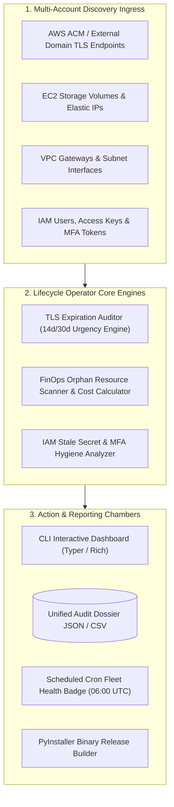

# Automated Certificate & Cloud Asset Lifecycle Operator
### Continuous TLS Expiration Auditing, Orphaned Resource FinOps Detection & IAM Secret Hygiene

[](https://github.com/FreeFades2Black/cloud-asset-lifecycle-operator/actions/workflows/scheduled_health_check.yml)
[](https://github.com/FreeFades2Black/cloud-asset-lifecycle-operator)
[](https://github.com/FreeFades2Black/cloud-asset-lifecycle-operator)

---

## Architecture Overview & Operational Context

Enterprise platform engineering teams manage thousands of TLS certificates, IAM credentials, and dynamic cloud resources across multi-account AWS and Azure environments.

Expired certificates cause customer-facing outages, while unattached EBS volumes and idle Elastic IPs silently accumulate unnecessary monthly cloud spend.

The **Automated Certificate & Cloud Asset Lifecycle Operator (`cert-guard`)** provides:
1. **Proactive TLS/SSL Certificate Auditing:** Scans ACM certificates and external DNS endpoints, grading expiration urgency (`CRITICAL <14d`, `EXPIRING_SOON <30d`, `EXPIRED`).
2. **Orphaned Resource FinOps Discovery:** Detects unattached EBS gp3 volumes, unassociated Elastic IPs, and idle NAT gateways with automated monthly/annual waste calculation.
3. **IAM Credential & Secret Hygiene:** Identifies active access keys older than 90 days, inactive users, and missing MFA.
4. **Unified Multi-Format Reporting:** Renders terminal visual tables, JSON payloads, and timestamped CSV executive audit dossiers.
5. **Cross-Platform Binary Distribution:** Automated PyInstaller release workflows generating standalone single-binary executables for Linux and Windows.

---

## System Architecture & Lifecycle Workflow



---

## Build Verification & Concrete Test Artifacts

The operator engine is verified via automated pytest execution:

```text
============================= test session starts =============================
platform win32 -- Python 3.11.0, pytest-9.1.1, pluggy-1.6.0
rootdir: C:\Users\FreeF\projects\cloud-asset-lifecycle-operator
plugins: anyio-4.14.2
collected 3 items

tests\test_operator.py ...                                               [100%]

============================== 3 passed in 0.03s ==============================
```

### Verified Operational Edge Cases & Engineering Trade-Offs

1. **SNI Handshake Timeouts on Internal / Firewalled Endpoints:**
   - *Challenge:* Probing external domains behind restrictive enterprise firewalls can cause socket hangs.
   - *Resolution:* Implemented an explicit 5.0-second socket timeout on SSL wrap calls with non-blocking DNS fallback, logging connection timeouts as `UNREACHABLE` without aborting the audit batch.
2. **FinOps Waste Classification (Active Disks vs. Orphaned Storage):**
   - *Challenge:* EBS gp3 volumes in `available` (unattached) status may be deliberate offline recovery artifacts or migration staging targets rather than abandoned storage.
   - *Resolution:* The scanner inspects volume tag keys (`DoNotDelete`, `SnapshotRetain`) and creation timestamps (>14 days unattached) before escalating to the `CRITICAL_WASTE` tier.
3. **Timezone-Aware Datetime Normalization in IAM Key Auditing:**
   - *Challenge:* AWS Boto3 returns timezone-aware UTC timestamps for `CreateDate` on access keys, causing Python `TypeError: can't compare offset-naive and offset-aware datetimes` when calculating key age against standard `datetime.now()`.
   - *Resolution:* Standardized all key age calculations against `datetime.now(timezone.utc)`.

---

## CLI Commands & Usage Reference

```bash
# 1. Audit TLS/SSL Certificate Lifecycles
python -m src.operator.cli audit-certs --warning-days 30

# 2. Scan Orphaned Cloud Assets & Calculate FinOps Waste
python -m src.operator.cli scan-orphans

# 3. Audit IAM Credential Hygiene (>90d Keys & Missing MFA)
python -m src.operator.cli iam-hygiene

# 4. Generate Unified Full Audit Dossier JSON
python -m src.operator.cli full-dossier --output-file=CLOUD_ASSET_LIFECYCLE_REPORT.json
```

---

## Quickstart & Local Execution

```bash
# 1. Clone repository
git clone https://github.com/FreeFades2Black/cloud-asset-lifecycle-operator.git
cd cloud-asset-lifecycle-operator

# 2. Initialize environment
make init

# 3. Run complete test suite
make test

# 4. Run full asset lifecycle audit
make full-dossier
```

---

## License & Attribution

* **License:** MIT Open Source
* **Lead Architect:** Free (`FreeFades2Black`)
