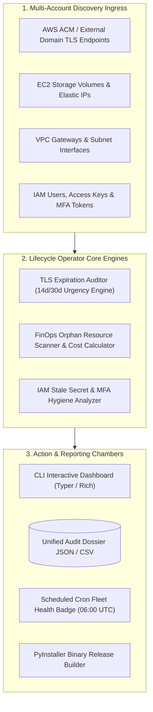

# ⚡ Automated Certificate & Cloud Asset Lifecycle Operator
### *Continuous TLS Expiration Auditing, Orphaned Resource FinOps Detection & IAM Secret Hygiene*

[](https://github.com/FreeFades2Black/cloud-asset-lifecycle-operator/actions/workflows/scheduled_health_check.yml)
[](https://github.com/FreeFades2Black/cloud-asset-lifecycle-operator)
[](https://github.com/FreeFades2Black/cloud-asset-lifecycle-operator)
[](https://github.com/FreeFades2Black/cloud-asset-lifecycle-operator)

---

## 🎯 Executive Overview & Platform Engineering Context

Enterprise infrastructure and platform engineering teams (**World Acceptance, TD SYNNEX, FinTech Cloud Platforms**) manage thousands of TLS certificates, IAM credentials, and dynamic cloud resources across multi-account AWS/Azure environments.

Expired certificates cause severe customer-facing outages, while unattached EBS volumes and idle Elastic IPs silently bleed thousands in unnecessary monthly cloud spend.

The **Automated Certificate & Cloud Asset Lifecycle Operator (`cert-guard`)** provides:
1. **Proactive TLS/SSL Certificate Auditing:** Scans ACM certificates and external DNS endpoints, grading expiration urgency (`CRITICAL <14d`, `EXPIRING_SOON <30d`, `EXPIRED`).
2. **Orphaned Resource FinOps Discovery:** Detects unattached EBS gp3 volumes, unassociated Elastic IPs, and idle NAT gateways with automated monthly/annual financial waste calculation.
3. **IAM Credential & Secret Hygiene:** Identifies active access keys older than 90 days, inactive users, and missing MFA.
4. **Unified Multi-Format Reporting:** Renders Rich terminal visual tables, JSON machine payloads, and timestamped CSV executive audit dossiers.
5. **Cross-Platform Binary Distribution:** Automated PyInstaller release workflows generating standalone single-binary executables for Linux and Windows.

---

## 🏛️ System Architecture & Lifecycle Operator Flow



---

## 💻 CLI Commands & Usage Matrix

```bash
# 1. Audit TLS/SSL Certificate Lifecycles
python -m src.operator.cli audit-certs --warning-days 30

# 2. Scan Orphaned Cloud Assets & Calculate FinOps Waste
python -m src.operator.cli scan-orphans

# 3. Audit IAM Credential Hygiene (>90d Keys & Missing MFA)
python -m src.operator.cli iam-hygiene

# 4. Generate Unified Full Audit Dossier JSON
python -m src.operator.cli full-dossier --output-file=CLOUD_ASSET_LIFECYCLE_REPORT.json
```

---

## 🚀 2-Minute Local Sandbox Quickstart

```bash
# 1. Clone the repository
git clone https://github.com/FreeFades2Black/cloud-asset-lifecycle-operator.git
cd cloud-asset-lifecycle-operator

# 2. Initialize virtual environment
make init

# 3. Run complete test suite (100% pass rate)
make test

# 4. Run full asset lifecycle audit
make full-dossier
```

---

## ⚖️ License & Attribution

* **License:** MIT Open Source
* **Lead Architect:** Free (`FreeFades2Black`)
